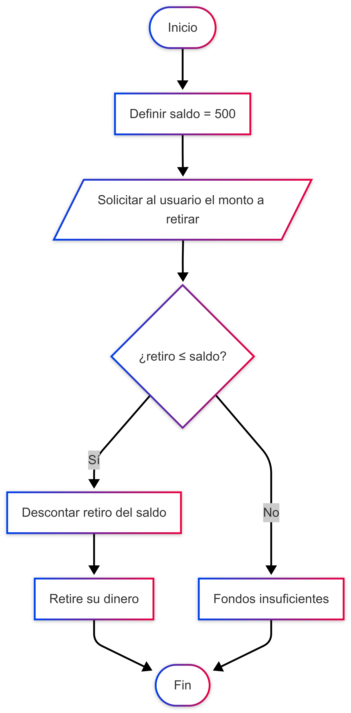

<!DOCTYPE html>
<html lang="es">
<head>
    <meta charset="UTF-8">
    <meta name="viewport" content="width=device-width, initial-scale=1.0">
    <title>Algoritmo de Cajero Automático</title>
    
</head>
<body>

    

        <h1>Algoritmo de Cajero Automático</h1>

        <h2>Pseudocódigo en PSeInt</h2>
        <pre><code>Proceso CajeroAutomatico
    // Declaración de variables
    Definir saldo, retiro Como Real;

    // Asignación de saldo inicial
    saldo &lt;- 500;

    // Solicitar la entrada del usuario
    Escribir "Bienvenido. Su saldo actual es: ", saldo;
    Escribir "Por favor, ingrese el monto que desea retirar:";
    Leer retiro;

    // Estructura de decisión: verifica si hay fondos suficientes
    Si retiro &lt;= saldo Entonces
        // Acciones si el saldo es suficiente
        saldo &lt;- saldo - retiro;
        Escribir "Retire su dinero";
        Escribir "Su nuevo saldo es: ", saldo;
    SiNo
        // Acciones si el saldo es insuficiente
        Escribir "Fondos insuficientes";
    FinSi

    Escribir "Gracias por su visita.";

FinProceso
</code></pre>

        <h2>Diagrama de Flujo (Mermaid)</h2>
        
Este es el código que representa la lógica del algoritmo de forma visual. Para visualizarlo, necesitarías una librería de Mermaid o un editor compatible.

        <pre><code>flowchart TD
    INICIO ([Inicio])
    ENTRADA [/Solicitar al usuario el monto a retirar/]
    PROCESO1 [[Definir saldo = 500]]
    DECISION {¿retiro &lt;= saldo?}
    PROCESO2 [[Descontar retiro del saldo]]
    SALIDA1 ["Retire su dinero"]
    SALIDA2 ["Fondos insuficientes"]
    FIN ([Fin])

    INICIO -> PROCESO1 -> ENTRADA
    ENTRADA -> DECISION
    DECISION -- Sí -> PROCESO2 -> SALIDA1 -> FIN
    DECISION -- No -> SALIDA2 -> FIN
</code></pre>

        <h2>Diagrama de Flujo (Imagen)</h2>
        
    

</body>
</html>