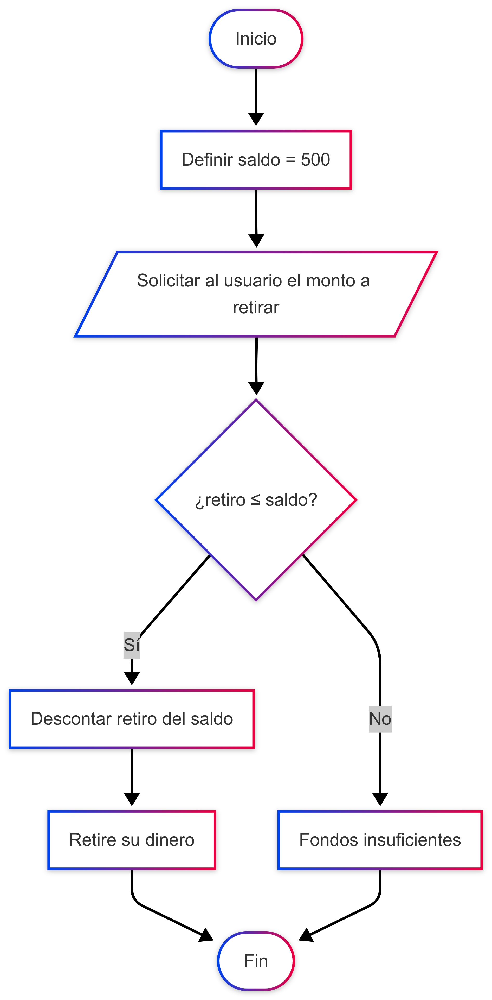

# Proceso Cajero Automático

## Pseudocódigo

```pseudocode
Proceso CajeroAutomatico
    // Declaración de variables
    Definir saldo, retiro Como Real;

    // Asignación de saldo inicial
    saldo <- 500;

    // Solicitar la entrada del usuario
    Escribir "Bienvenido. Su saldo actual es: ", saldo;
    Escribir "Por favor, ingrese el monto que desea retirar:";
    Leer retiro;

    // Estructura de decisión: verifica si hay fondos suficientes
    Si retiro <= saldo Entonces
        // Acciones si el saldo es suficiente
        saldo <- saldo - retiro;
        Escribir "Retire su dinero";
        Escribir "Su nuevo saldo es: ", saldo;
    SiNo
        // Acciones si el saldo es insuficiente
        Escribir "Fondos insuficientes";
    FinSi

    Escribir "Gracias por su visita.";

FinProceso
```

---

## Diagrama de Flujo (Mermaid)

```mermaid
flowchart TD
    INICIO([Inicio])
    ENTRADA[/Solicitar al usuario el monto a retirar/]
    PROCESO1[Definir saldo = 500]
    DECISION{¿retiro ≤ saldo?}
    PROCESO2[Descontar retiro del saldo]
    SALIDA1["Retire su dinero"]
    SALIDA2["Fondos insuficientes"]
    FIN([Fin])

    INICIO --> PROCESO1 --> ENTRADA
    ENTRADA --> DECISION
    DECISION -- Sí --> PROCESO2 --> SALIDA1 --> FIN
    DECISION -- No --> SALIDA2 --> FIN
```

---

## Diagrama en Imagen


